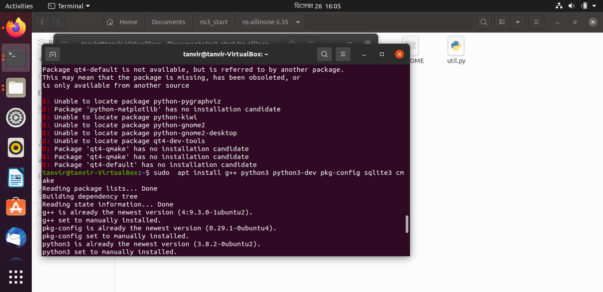
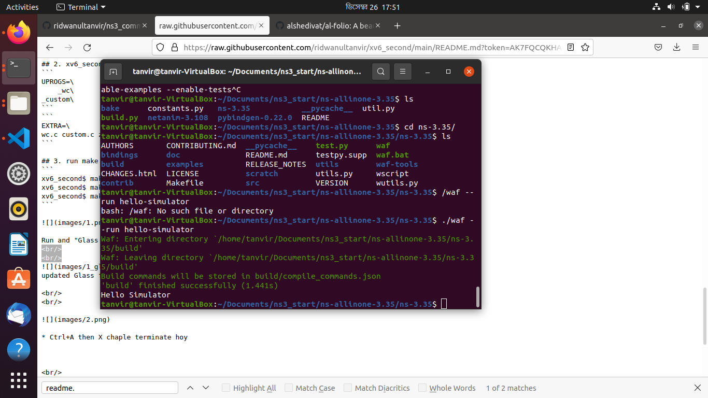
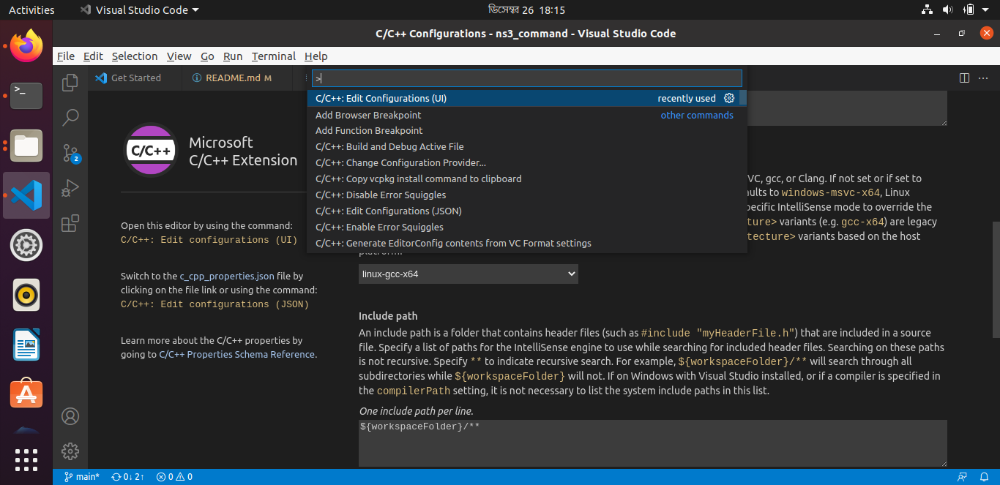
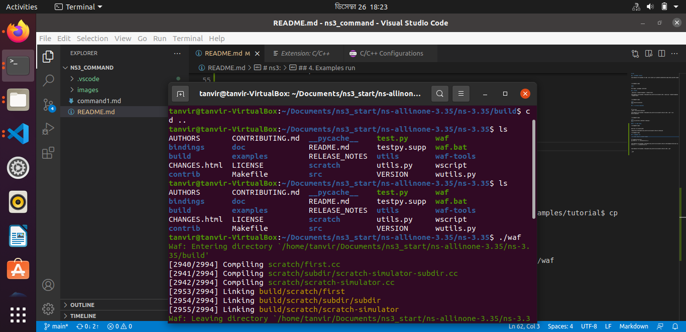
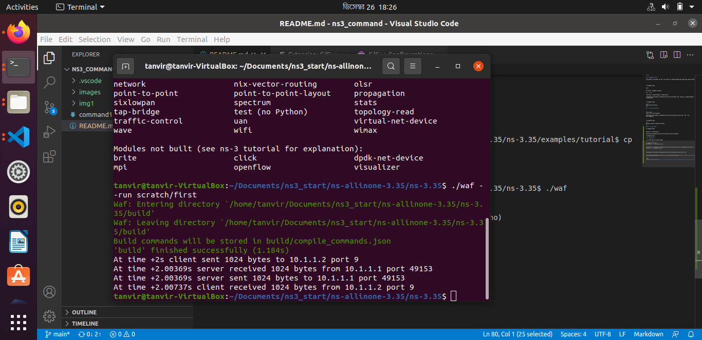

# ns3: 


## 1. packages install
```
tanvir@tanvir-VirtualBox:~$ sudo  apt install g++ python3 python3-dev pkg-config sqlite3 cmake

```




<br/>
<br/>

Pre-requis. packages installed 

## 2. build: 
```
./build.py --enable-examples --enable-tests
```
tanvir@tanvir-VirtualBox:~/Documents/ns3_start/ns-allinone-3.35$ ./build.py --enable-examples --enable-tests


<br/>
After Build Successful 
<br/>

## 3. run hello-simulator


```
cd ns-3.35/
./waf --run hello-simulator
```
tanvir@tanvir-VirtualBox:~/Documents/ns3_start/ns-allinone-3.35/ns-3.35$ ./waf --run hello-simulator




<br/>
waf run and hello simulator showing s
<br/>

### 4. vs code setup


add this to include path: 

/home/tanvir/Documents/ns3_start/ns-allinone-3.35/ns-3.35/build



## 4. Examples run

* copy files copy to scratch folder     

```
cd examples/tutorial/
cp first.cc ../../scratch/first.cc
```

tanvir@tanvir-VirtualBox:~/Documents/ns3_start/ns-allinone-3.35/ns-3.35/examples/tutorial$ cp first.cc ../../scratch/first.cc



tanvir@tanvir-VirtualBox:~/Documents/ns3_start/ns-allinone-3.35/ns-3.35$ ./waf


./waf --run scratch/first  (first.cc : .cc er bade baki ongsho)

```
./waf
./waf --run scratch/first 
```


