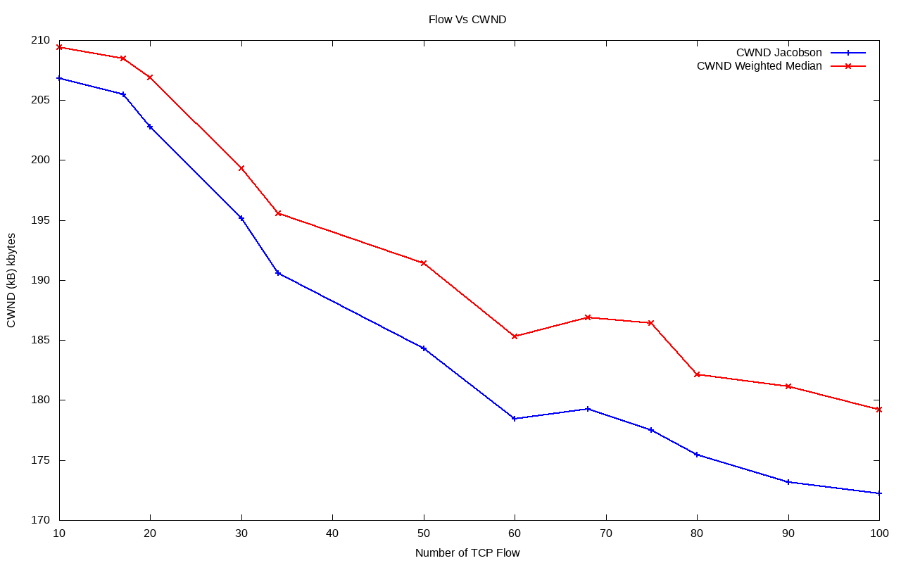
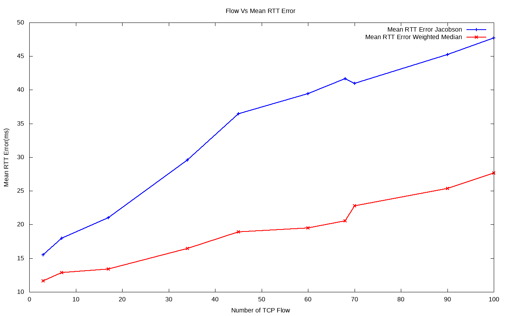
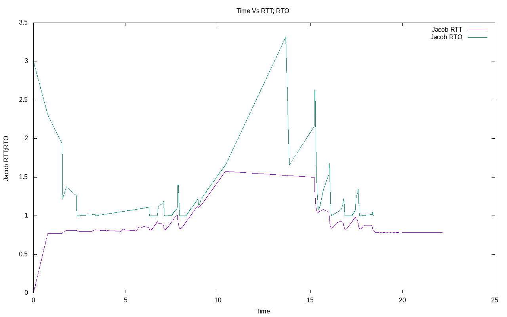
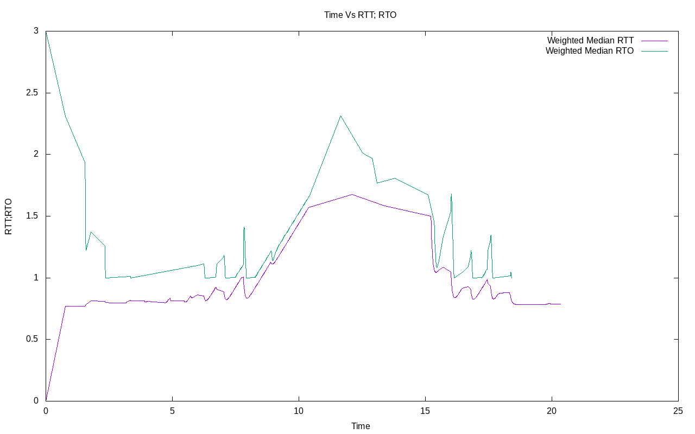

## Retransmission_Timeout_Weighted_RTW_NS3

[RTW_Report_NS3.pdf](https://github.com/ridwanultanvir/Retransmission_Timeout_Weighted_RTW_NS3/blob/master/Report/RTW_Report_NS3.pdf)

- The proposed RTO algorithm utilizing recursive weighted median (RWM) filters yields significantly tighter RTT bounds than Jacobson's algorithm over Internet traffic with heavy tailed statistics.
- The RWM filters are more effective in impulsive signal environments, which is often the case with RTT signals with heavy tailed statistics. This is due to the fact that linear filters, such as Jacobson's algorithm, are adequate for estimation in Gaussian signal environments but not as effective in impulsive signal environments.

## Comparison of RTW and Jacobson's Algorithm

### CWND 

  
   
  <em>Fig: CWND graph</em>

<!-- 
*FLow vs CWND graph* -->

### MEAN RTT Error 

<!-- 
*FLow vs MEAN RTT Error* -->

  
   
  <em>Fig: MEAN RTT Error Graph</em>

### RTT RTO Plot

<!-- 
*RTT RTO Plot Jacobson*

*RTT RTO Plot weighted RTW* -->

  
   
  <em>Fig: RTT RTO Plot Jacobson</em>

  
   
  <em>Fig: RTT RTO Plot weighted RTW</em>

